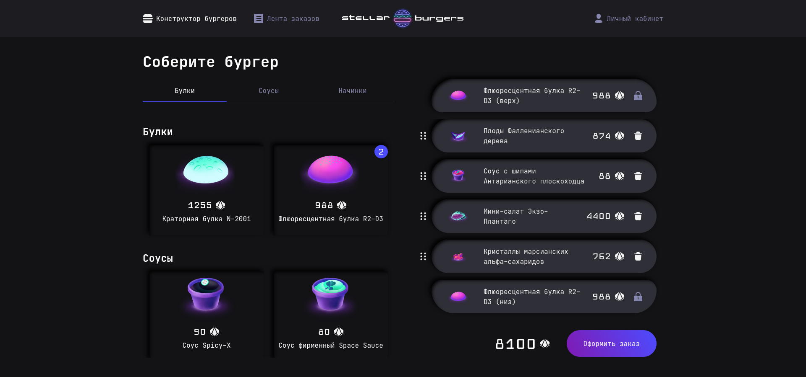

# Stellar Burgers

Данный проект содержит:

- авторизацию пользователя
- взаимодействие с элементами при помощи drag&drop
- кастомную валидацию форм
- взаимодействие с api
- pc и mobile версии

## Ссылка на проект

<a href="https://stellar-burgers-murex.vercel.app/" target="_blank">
https://stellar-burgers-murex.vercel.app
</a>

## Технологии


## Инструкция по запуску

```bash
git clone https://github.com/ArtemMazin/StellarBurgers.git
npm install
npm start

//тесты
npm run test
npm run cypress

//линтеры
npm run stylelint
npm run lint
```


